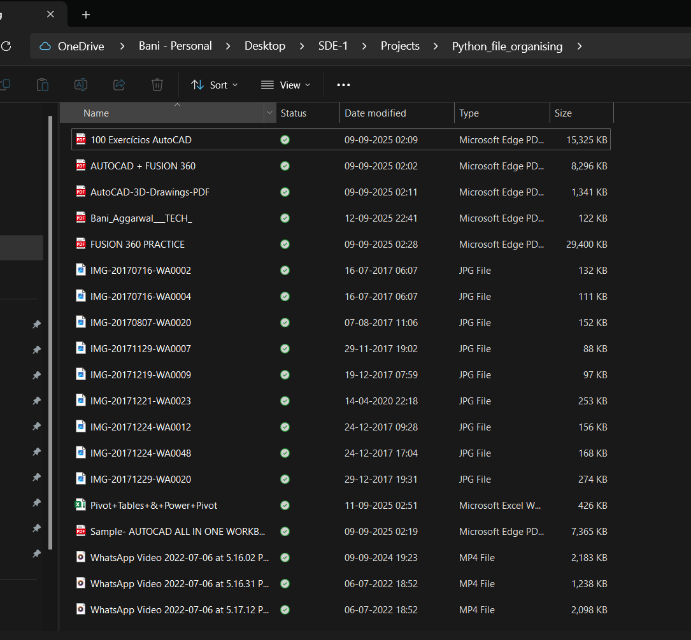
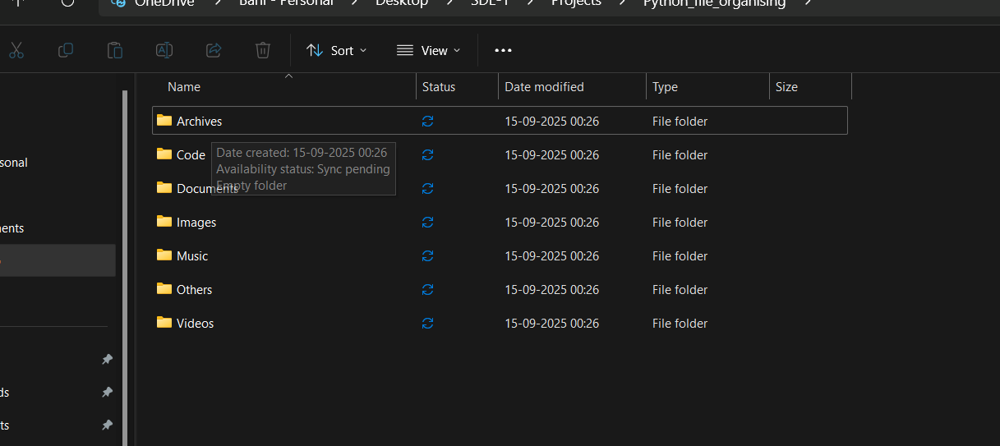

# 📂 Python File Organizer (CLI Tool)

## 🚀 Overview

A simple **Python-based Command Line Interface (CLI) tool** that helps you automatically organize files in a folder based on their file type (e.g., documents, images, videos, audio, code files).  
This project showcases skills in **Python scripting, file handling, automation, and clean code practices**.

---

## ✨ Features

- Organizes files into categorized folders (Documents, Images, Videos, Audio, Others).
- Works on any directory (local machine).
- Lightweight and beginner-friendly.
- Demonstrates use of **os, shutil, and argparse** modules.

---

## ⚙️ Tech Stack

- **Language:** Python 3.x
- **Modules Used:** os, shutil, argparse

---

## 📸 Output Screenshots

### 📝 Before Running



### 📂 After Running



---

## ▶️ How to Run

1. Clone this repository:
   ```bash
   git clone https://github.com/Bani-1525/File-Organizer-.git
   cd file-organizer
   ```

```

```
